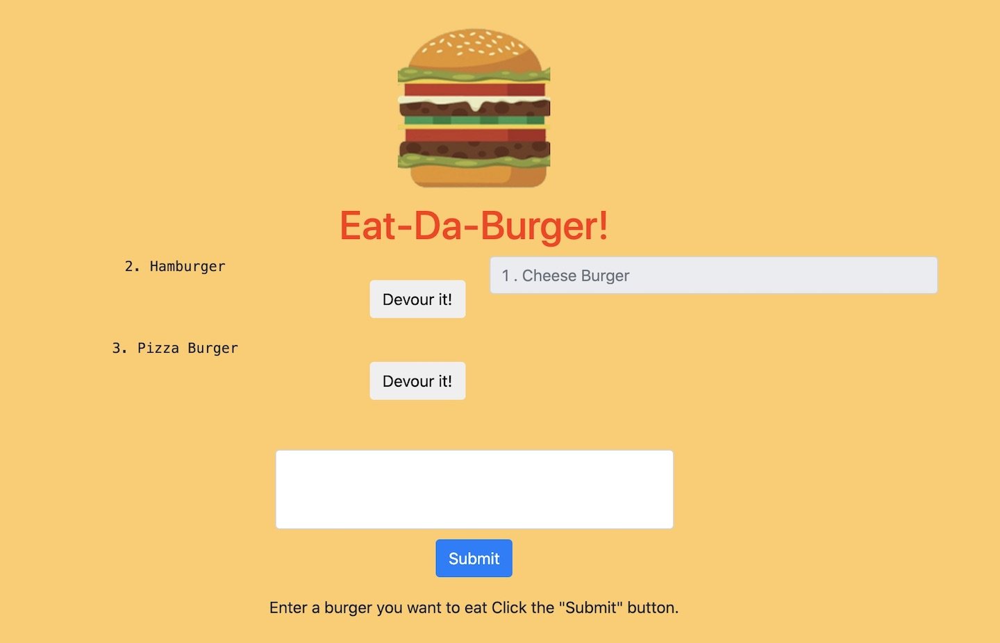

# 🍔 burger 🍔

  
  
  
  
  

  
  
  
  
  
  
  

 
  
  
  # Description
  📝 This is a burger logger with MySQL, Node, Express, Handlebars and a homemade ORM (yum!). It's follow the MVC design pattern; use Node and MySQL to query and route data in the app, and Handlebars to generate HTML.
 

  # Table of Contents
  - [Description](#description)
  - [Usage](#usage)
  - [Installation](#installation)
  - [Links](#links)

# Minimum requirements
```
Attempt to complete homework assignment as described in instructions. If unable to complete certain portions, please pseudocode these portions to describe what remains to be completed. Hosting on Heroku and adding a README.md are required for this homework. In addition, add this homework to your portfolio.
```

# Installation
🗳 <code>Node.js</code>,<code>npm install</code>,<code>npm install express</code>,<code> Heroku</code><code>npm install express-handlebars</code><code>npm install mysql</code>

# Usage
💻 Open [Heroku](https://burger--handlebars.herokuapp.com/burgers) link, write your burger menue, click "submite," and then,click "Devour it!".  

 
  
# Links
:atom_symbol: [Heroku](https://burger--handlebars.herokuapp.com/burgers)<br />
:octocat: Github [Repo](https://github.com/jmorris107/burger) / [Account](https://github.com/)<br />
<br />
  